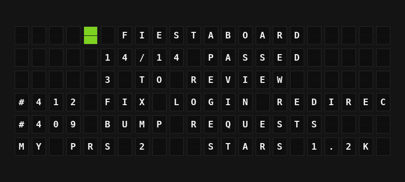

# GitHub Plugin

Show the pull requests waiting for your review, your own open pull requests, and the CI status and stars of a repository.



**→ [Setup Guide](./docs/SETUP.md)**

## Overview

The GitHub plugin reads your GitHub account through the GitHub REST API: open pull requests where your review is requested, the open pull requests you wrote, and, for one repository you choose, whether the checks on its latest commit pass and how many stars it has. Everything becomes board-ready variables such as `3 TO REVIEW`, `#412 FIX LOGIN REDIRECT` and `14/14 PASSED`.

Setup is one click: open the plugin's settings, press **Sign in with GitHub**, and enter the code it shows at github.com/login/device on any device. The sign-in uses FiestaBoard's own GitHub App, [FiestaBoard](https://github.com/apps/fiestaboard), so there is no app to create and no password, token or client secret to paste. Public repositories work straight away; to see private ones, [install the app](https://github.com/apps/fiestaboard) on the account or organization that owns them. Requires FiestaBoard 9.8.0 or later.

## Template Variables

### Review Requests

| Variable | Description | Example |
|----------|-------------|---------|
| `{{github.review_count}}` | Open pull requests waiting for your review | `3` |
| `{{github.review_title}}` | Title of the most recently updated one | `FIX LOGIN REDIRECT` |
| `{{github.review_repo}}` | Its repository name | `FIESTABOARD` |
| `{{github.review_number}}` | Its pull request number | `412` |
| `{{github.review_author}}` | Who opened it | `OCTOCAT` |
| `{{github.review_line}}` | Number and title on one line | `#412 FIX LOGIN REDIRECT` |
| `{{github.reviews.0.title}}` | Pull request title, entry 0-4 | `FIX LOGIN REDIRECT` |
| `{{github.reviews.0.repo}}` | Repository name, entry 0-4 | `FIESTABOARD` |
| `{{github.reviews.0.number}}` | Pull request number, entry 0-4 | `412` |
| `{{github.reviews.0.author}}` | Who opened it, entry 0-4 | `MONA` |
| `{{github.reviews.0.line}}` | Number and title on one line, entry 0-4 | `#412 FIX LOGIN REDIRECT` |

### My Pull Requests

| Variable | Description | Example |
|----------|-------------|---------|
| `{{github.my_pr_count}}` | Your own open pull requests | `2` |
| `{{github.my_pr_title}}` | Title of your most recently updated one | `ADD DARK MODE` |
| `{{github.my_pr_repo}}` | Its repository name | `FIESTABOARD` |
| `{{github.my_pr_number}}` | Its pull request number | `418` |
| `{{github.my_pr_line}}` | Number and title on one line | `#418 ADD DARK MODE` |
| `{{github.my_draft_count}}` | How many of your open pull requests are drafts | `1` |
| `{{github.my_prs.0.title}}` | Pull request title, entry 0-4 | `ADD DARK MODE` |
| `{{github.my_prs.0.repo}}` | Repository name, entry 0-4 | `FIESTABOARD` |
| `{{github.my_prs.0.number}}` | Pull request number, entry 0-4 | `418` |
| `{{github.my_prs.0.author}}` | Who opened it, entry 0-4 | `OCTOCAT` |
| `{{github.my_prs.0.line}}` | Number and title on one line, entry 0-4 | `#418 ADD DARK MODE` |

### Repository

| Variable | Description | Example |
|----------|-------------|---------|
| `{{github.repo}}` | The configured repository's name | `FIESTABOARD` |
| `{{github.repo_full}}` | Owner and name | `OCTO-ORG/FIESTABOARD` |
| `{{github.branch}}` | Branch whose checks are shown (the default branch unless set) | `MAIN` |
| `{{github.stars}}` | Star count | `1234` |
| `{{github.stars_short}}` | Star count, shortened | `1.2K` |

### CI Status

| Variable | Description | Example |
|----------|-------------|---------|
| `{{github.ci_status}}` | PASSING, FAILING, RUNNING or NO CHECKS for the latest commit | `PASSING` |
| `{{github.ci_tile}}` | One colour tile: green passing, red failing, yellow running (empty with no checks) | `{66}` |
| `{{github.ci_summary}}` | Checks in a few words | `14/14 PASSED` |
| `{{github.ci_passed}}` | Checks that finished without failing (success, neutral or skipped) | `14` |
| `{{github.ci_failed}}` | Checks that failed, timed out, were cancelled or need action | `0` |
| `{{github.ci_running}}` | Checks still queued or running | `0` |
| `{{github.ci_total}}` | All checks on the latest commit | `14` |
| `{{github.ci_failing_name}}` | Name of the first failing check | `LINT` |
All text is in capitals, accents are folded, and characters the board can't show are dropped. The `reviews` and `my_prs` lists hold the five most recently updated pull requests; the counts include all of them.

## Example Templates

Flagship (first three lines centered, the demo page):

```jinja
{{github.ci_tile}} {{github.repo}}
{{github.ci_summary}}
{{github.review_count}} TO REVIEW
{{github.reviews.0.line}}
{{github.reviews.1.line}}
MY PRS {{github.my_pr_count}}   STARS {{github.stars_short}}
```

Note (left-aligned):

```jinja
{{github.ci_tile}} {{github.repo}}
REVIEW {{github.review_count}} MINE {{github.my_pr_count}}
STARS {{github.stars_short}}
```

Build watcher (Flagship, center-aligned):

```jinja
{{github.repo_full}}
{{github.branch}}

{{github.ci_tile}} {{github.ci_status}}
{{github.ci_summary}}
{{github.ci_failing_name}}
```

## Configuration

| Setting | Type | Required | Default | Description |
|---------|------|----------|---------|-------------|
| `enabled` | boolean | No | `false` | Turn the plugin on |
| `client_id` | string | No | FiestaBoard's app | Your own Client ID (optional): leave blank to use FiestaBoard's GitHub App. Only needed to sign in through a GitHub App of your own (starts with `Iv`) |
| `repository` | string | No | | Repository for the CI and star variables, as `owner/name` (a `github.com` link also works). Empty shows only pull requests |
| `branch` | string | No | | Branch whose checks are shown. Empty uses the repository's default branch |
| `refresh_seconds` | integer | No | `120` | How often to ask GitHub (60-3600) |

The sign-in itself is not a setting: press **Sign in with GitHub** in the plugin's **Account connection** section. The manifest's `oauth` block declares GitHub's device flow (`https://github.com/login/device/code` and `https://github.com/login/oauth/access_token`) with FiestaBoard's GitHub App Client ID (`Iv23licsxgFjES7n3PnG`), no scopes and no client secret: a GitHub App's access comes from the permissions set on the app, not from scopes. FiestaBoard's app has only read-only permissions (Actions, Checks, Issues, Pull requests and Metadata); the plugin uses these:

| Permission | Used for |
|------------|----------|
| Pull requests: Read | `GET /search/issues` with `review-requested:@me` and `author:@me` (private repositories) |
| Checks: Read | `GET /repos/{owner}/{repo}/commits/{ref}/check-runs` |
| Metadata: Read | `GET /repos/{owner}/{repo}` (always granted) |

Public repositories need no installation. For private ones, install the app at [github.com/apps/fiestaboard](https://github.com/apps/fiestaboard) on the account or organization that owns them (all repositories or selected ones). User access tokens last 8 hours; FiestaBoard refreshes them (device-flow tokens refresh without a client secret).

No environment variables.

### Using your own GitHub App (optional)

If you'd rather sign in through a GitHub App you control, create one with **Enable Device Flow** ticked and the Checks and Pull requests read-only permissions, then paste its Client ID into **Your own Client ID (optional)**. A saved Client ID always wins over FiestaBoard's; clear it to go back. The [setup guide](./docs/SETUP.md#advanced-use-your-own-github-app) has the steps.

## Features

- Signs in with a code through FiestaBoard's account connection (GitHub's device flow): works on a board on your home network, with no redirect URI, password, token or client secret
- Review requests and your own pull requests, newest activity first, with counts, numbers, titles, repositories and authors; drafts counted separately
- CI status of a repository's default branch (or a branch you pick) from its check runs: passing, failing, running or no checks, with a colour tile and the first failing check's name
- Star count, in full and shortened (`1.2K`)
- Four requests per refresh at most, shared between every board showing the plugin; well inside GitHub's search limit of 30 requests a minute
- Respects GitHub's rate limits (`Retry-After` and `X-RateLimit-Reset`), backs off after outages and rejected sign-ins, and keeps showing the last data for up to ten minutes during an outage
- Error messages say what to do: sign in, reconnect after a `401`, install the app at github.com/apps/fiestaboard after a `403`, fix the repository (or install the app) or branch after a `404`
- Never uses the notifications API, which does not accept GitHub App tokens
- Works on every board shape: Flagship, Note, and Note arrays

## Author

FiestaBoard Team
